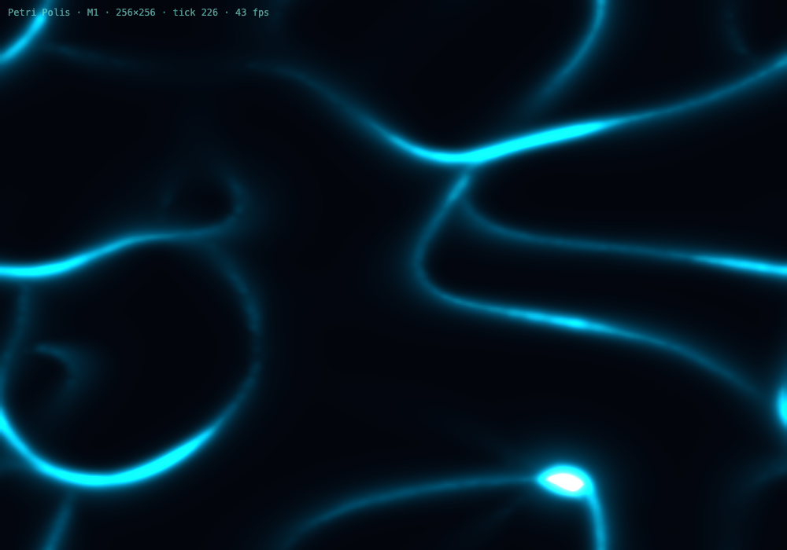

# Petri Polis

[](https://github.com/VitalyVorobyev/petri-polis/actions/workflows/ci.yml)
[](https://vitalyvorobyev.github.io/petri-polis/)
[](LICENSE)


**A bioluminescent toy for watching complex patterns grow out of a few simple rules.**

### ▶ [Play it in your browser](https://vitalyvorobyev.github.io/petri-polis/app/) — no install needed.

Thousands of tiny agents each follow one dumb instruction — *drop a glowing trail, sense the
glow ahead, steer toward it* — and with no central plan they weave themselves into living,
branching networks. It's the [Physarum](https://en.wikipedia.org/wiki/Physarum_polycephalum)
(slime-mold) algorithm, rendered as light. Open it, and you watch a world organize itself.

Two species — drawn in **cyan** and **magenta** — each weave their own competing network over a
shared, regrowing **food** field, so the world also breathes: populations boom into rich patches,
deplete them, crash, and recover. You can tune every rule live, inspect any cell, measure a run as
a metric series, and share the exact run as a URL.



The simulation runs as fast native **Rust compiled to WebAssembly**; the visuals are pure
**WebGL2** — the glowing trail field is colour-mapped and bloomed entirely on the GPU. It's a
single static web page: no backend, no install beyond a browser once it's built.

---

## Quick start

You need three things installed: **[Rust](https://rustup.rs/)** (with the
`wasm32-unknown-unknown` target), **[wasm-pack](https://rustwasm.github.io/wasm-pack/)**, and
**[bun](https://bun.sh/)**.

```bash
# one-time: add the wasm target
rustup target add wasm32-unknown-unknown

# 1. build the Rust simulation → WebAssembly (into app/src/wasm/)
bash scripts/build-wasm.sh

# 2. install frontend deps and start the dev server
cd app
bun install
bun run dev
```

Open **http://localhost:5173** and watch the network form within a few seconds.

To make a production build: `bash scripts/build-wasm.sh --release && (cd app && bun run build)`.

---

## How it works

Every tick, each agent:

1. **Senses** its own species' trail field at three points ahead of it (left / centre / right),
2. **Steers** a little toward whichever side has the strongest trail,
3. **Moves** forward and **deposits** a bit of trail where it lands.

Then each trail field is gently **blurred** (so trails spread into a soft glow) and **faded** (so
unused paths evaporate). Reinforcement does the rest: busy routes get brighter and attract more
agents; abandoned ones disappear. No agent knows about the network — the network is just what's
left over.

On top of that runs a light **ecology**: every agent spends energy each tick, eats from the
shared food field it stands on, **reproduces** when well-fed, and **dies** when it starves —
returning nutrient to the world. Patchy food plus survivors in still-rich pockets give the
characteristic **boom/bust** cycles. The two species share only that food field, so they compete
spatially and settle into interwoven networks neither makes alone.

Because every random choice comes from one **seeded** generator, the same seed always grows the
exact same world — runs are fully reproducible, which is what makes a shared URL replay an
identical run.

```
Rust sim (petri-core)  ──zero-copy──▶  WebGL2 renderer
  trail field(s) + agents               colour-map (cyan + magenta) → bloom → screen
  deposit · sense · steer               over a dim food substrate
  blur + fade · eat · breed · die       (bioluminescent palette)
```

The trail fields live in WebAssembly memory and are handed to the GPU **without copying** —
the renderer reads them directly, so even large fields stay smooth.

---

## Project status

This is a side project, built in milestones — each one meant to be visually rewarding on its own.

| | Milestone | State |
|---|---|---|
| **M0** | Toolchain round-trip (Rust ↔ WASM ↔ WebGL) | ✅ done |
| **M1** | The hook — Physarum trails + glowing render | ✅ done *(pictured above)* |
| **M2** | Live controls — tune the rules with sliders, spawn by click | ✅ done |
| **M3** | Ecology — energy, food, death feeds the world, regrowth | ✅ done |
| **M4** | Two species, competing into one picture | ✅ done |
| **M5** | Inspect a cell/agent · measure a run · share it by URL | ✅ done |
| **M6** | Scale (wasm-simd / threads / WebGPU) | optional, only if scale is craved |

See [`docs/ROADMAP.md`](docs/ROADMAP.md) for the gates and [`docs/DESIGN.md`](docs/DESIGN.md)
for the architecture and the design decisions behind it.

## Documentation

- **▶ [Live demo](https://vitalyvorobyev.github.io/petri-polis/app/)** — run the toy in your browser.
- **[The guide](https://vitalyvorobyev.github.io/petri-polis/guide/)** — a book on the concepts and
  algorithms: the Physarum rule, diffusion/decay, the ecology, two-species coexistence, determinism,
  and the zero-copy WASM boundary.
- **[API docs](https://vitalyvorobyev.github.io/petri-polis/api/)** — `cargo doc` for `petri-core`
  and `petri-wasm`.

The guide's source lives in [`docs/guide/`](docs/guide/); build it locally with `mdbook serve docs/guide`.

---

## Development

```bash
cargo test -p petri-core      # run the simulation's tests (no browser needed)
cargo clippy --workspace --all-targets -- -D warnings
cargo fmt --all
cd app && bun run lint        # Biome static analysis for the TypeScript renderer
```

CI runs Rust `fmt` / `clippy` / tests, builds the wasm and the frontend, and runs Biome on
every push and pull request. On every push to `main`, the live demo, the guide, and the API docs
are built and published to GitHub Pages.

## Repository layout

```
crates/petri-core   Pure Rust simulation (Physarum rule, ecology, seeded RNG) — native-testable
crates/petri-wasm   wasm-bindgen wrapper exposing the sim to JavaScript (zero-copy fields)
app/                Vite + TypeScript + WebGL2 renderer + Tweakpane UI (bun)
scripts/            build-wasm.sh
docs/               DESIGN.md · ROADMAP.md · BACKLOG.md · guide/ (the mdBook)
```

---

## Credits

The trail algorithm is Jeff Jones's *Physarum* transport-network model (2010); the
glowing-network aesthetic is inspired by Sage Jenson's "mold" work.

## License

[MIT](LICENSE) © 2026 Vitaly Vorobyev
