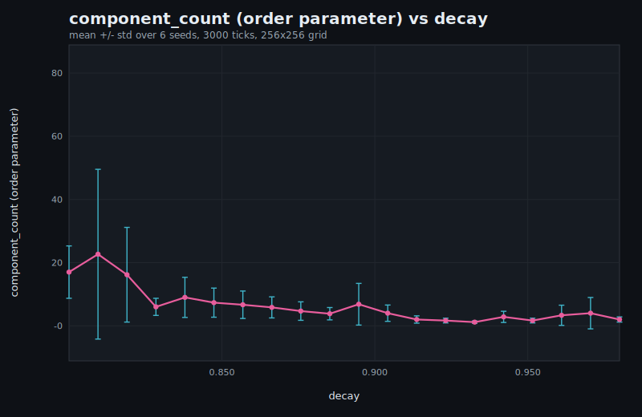

# Parameter sweeps & phase diagrams

A single run shows you *one* structure. The [structure metrics](./structure-metrics.md) showed
that the structure changes *suddenly* as a knob crosses a threshold. To find *where* those
thresholds are — to map the regimes rather than stumble on them — you run a **parameter sweep**:
vary one knob across many values, repeat over many seeds, and record an **order parameter** for
each run. Plot it and you have a **phase diagram** — the figure that turns "this is pretty" into
"the bifurcation is here."

## Why it can be headless

The simulation core is pure Rust with no browser and no GPU — the renderer is a separate layer.
So a sweep runs natively, hundreds of worlds back to back, with no rendering cost, reading the
same `component_count` the live sparklines plot. And because every run is deterministic, the whole
sweep is reproducible: the same configuration produces a byte-identical CSV on any machine, so a
phase diagram is a result you can publish and others can reproduce, not a lucky screenshot.

## The decay phase transition

The cleanest example sweeps `decay` — how slowly the trail evaporates — and records the number of
connected components, averaged over several seeds. At low decay the trail evaporates before it can
consolidate, so the field is fragmented speckle: many components. Raise decay and, at a threshold,
the speckle snaps into a connected network and the component count collapses. That collapse is the
order parameter crossing its critical value — a phase transition, located precisely:



The error bars are the spread across seeds; the knee is the bifurcation. Sweep a second knob as
well (diffusion, sensor distance) and the line becomes a heatmap — a two-dimensional phase diagram
of where each regime lives.

## Running a sweep

The sweep is a small native binary that takes a knob, a value range, a seed set, and a tick
budget, runs every combination headless on a modest grid, aggregates the order parameter across
seeds, and writes both a CSV (every run, plus per-value mean and spread) and a self-contained SVG
of the curve:

```bash
cargo run --release --bin sweep
```

There is no plotting dependency — the figure is hand-written SVG — and no backend: the sweep is
just the deterministic core, run many times, with its numbers tipped out to a file.
